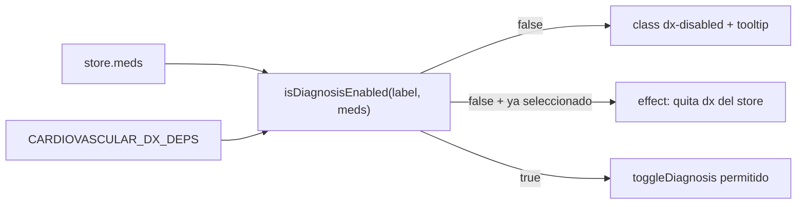
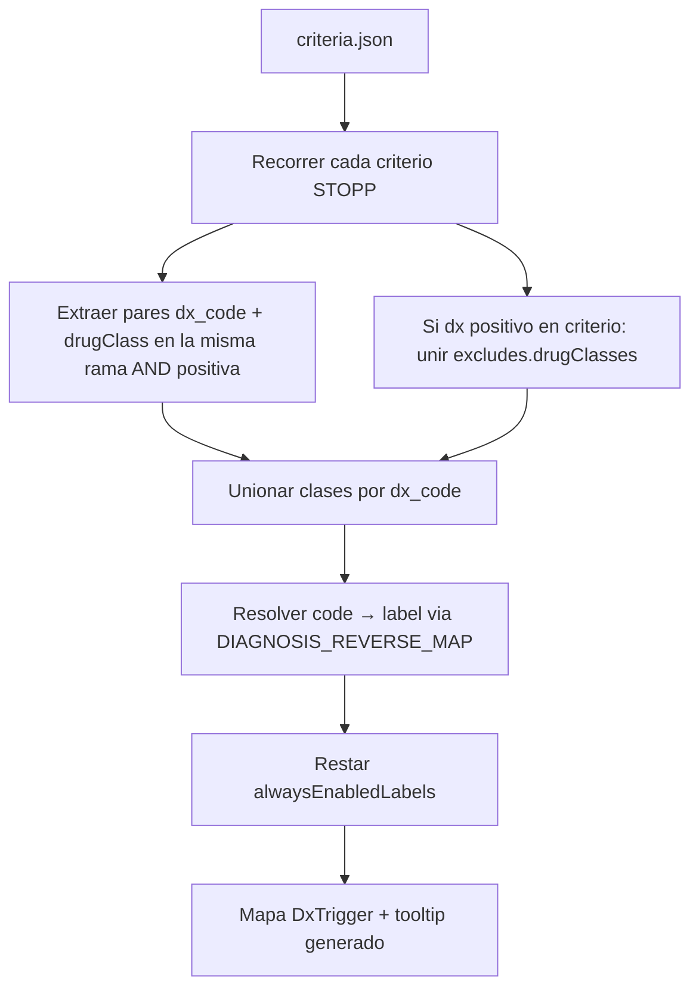
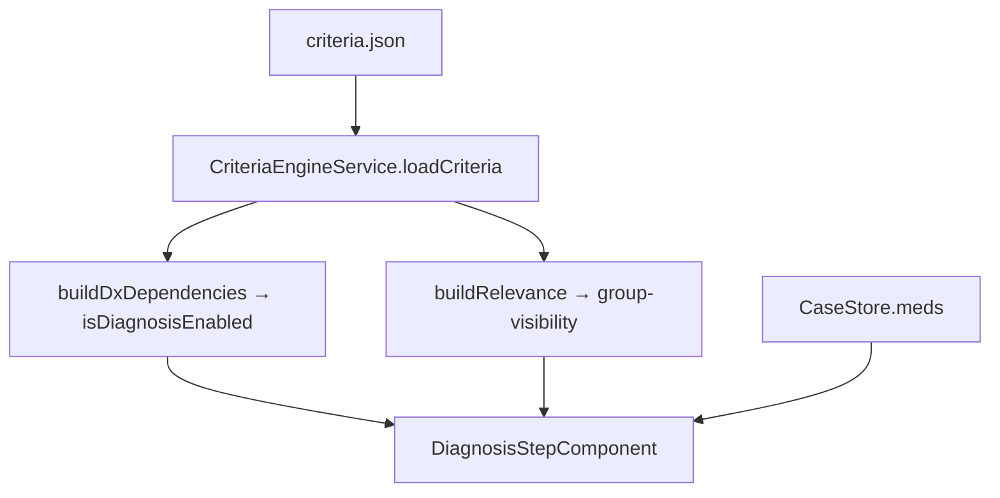

# Plan: sombreado de diagnósticos generalizado (derivado de criteria.json)

## Hallazgos de la investigación (Fase 1)

### 1. ¿Estático o dinámico?

**DINÁMICO** — depende del estado actual de medicaciones, no de si el diagnóstico aparece en criterios.

Flujo en `[diagnosis-step.component.ts](src/app/steps/diagnosis-step/diagnosis-step.component.ts)`:




- UI: `[class.dx-disabled]="!isDxEnabled(dx)"` + tooltip desde `CARDIOVASCULAR_DX_DEPS[label].tooltip` (`[diagnosis-step.component.html](src/app/steps/diagnosis-step/diagnosis-step.component.html)` L161–183).
- Lógica: `[isDiagnosisEnabled](src/app/core/data/cardiovascular-dx-dependencies.ts)` — si el label **no** está en el mapa → `true` (siempre habilitado); si está → habilitado solo si alguna `drugClass` (OR) o `id` de fármaco coincide con `store.meds()`.
- Efecto colateral: un `effect` deselecciona diagnósticos que quedan deshabilitados al cambiar medicación (L111–122).

**No es** “este diagnóstico no aparece en ningún criterio”. Es: “este diagnóstico solo tiene sentido clínico cuando ya hay medicación que puede disparar STOPP con él”.

### 2. Regla exacta de atenuación hoy


| Condición                                                | Resultado                               |
| -------------------------------------------------------- | --------------------------------------- |
| Label ausente de `CARDIOVASCULAR_DX_DEPS`                | Siempre habilitado                      |
| Label en mapa + ninguna med con clase/id requerida       | Deshabilitado (atenuado, no clickeable) |
| Label en mapa + al menos una med cumple OR de clases/ids | Habilitado                              |


12 labels cardiovascular gated manualmente; el resto (p. ej. `HTA`, `FA`, `Insuficiencia cardíaca`, enfermedad vascular) siempre habilitados — ver tests en `[cardiovascular-dx-dependencies.spec.ts](src/app/core/data/cardiovascular-dx-dependencies.spec.ts)` L46–86.

**Nota clínica/UX:** variantes HTA (`HTA grave`, etc.) están gated aunque START-B1 las referencia; el padre `HTA` no. Esto es decisión del piloto, no deducible solo de “¿puede activar algún criterio sin meds?”.

### 3. Evaluación de la vía estática preferida

**No viable** para preservar Cardiovascular ni para el objetivo real del piloto.


| Caso                                                                | ¿Rompe enfoque estático?                                                                                                                                                  |
| ------------------------------------------------------------------- | ------------------------------------------------------------------------------------------------------------------------------------------------------------------------- |
| **Med + dx** (STOPP B1, B4, F3, G1…)                                | Sí — el estático no gatea por medicación; dejaría todo referenciado siempre activo                                                                                        |
| **Labs + dx** (bradicardia OR `fc_lpm < 50`, QTc OR `qtc_ms ≥ 450`) | Sí — hoy tampoco se consideran labs para habilitar (gap conocido del piloto); estático ignora labs igual                                                                  |
| **Jerarquía HTA**                                                   | Padre `hta` y hijos `hipertension_grave` son códigos distintos; estático los trataría igual si ambos en criterios; el piloto distingue padre (libre) vs variantes (gated) |
| **Labels en catálogo sin criterio**                                 | 4 labels nunca en criteria.json (`aneurisma_aortico`, etc.) — estático los atenuaría; hoy están activos                                                                   |
| **START + STOPP compartidos**                                       | Variantes HTA en START-B1 y STOPP-B7 — estático las mantendría activas; piloto las gatea                                                                                  |


**Conclusión:** la vía elegida (confirmada) es **derivación dinámica** desde `criteria.json`, reutilizando el patrón de `[extractReferences](src/app/core/data/system-relevance.ts)` pero con semántica distinta a `buildRelevance` (que ya alimenta visibilidad de grupos foreign en `[group-visibility.ts](src/app/core/data/group-visibility.ts)`).

### 4. Datos de apoyo (exploración)

- **121** códigos dx referenciados positivamente en criteria; **70** solo en STOPP med+dx.
- **4** labels de catálogo nunca en criterios → siempre habilitados en cualquier enfoque sensato.
- El mapa manual **no** es subconjunto estricto de la lógica json: mismatches documentados que el algoritmo debe resolver vía reglas explícitas o overrides mínimos:
  - **Intervalo QTc prolongado**: manual 6 clases; criteria solo `PROLONGADOR_QTC` (B15).
  - **Insuficiencia cardíaca grave**: manual incluye `NITRATO`; criteria solo `INHIBIDOR_PDE5` con ese dx.
  - **Estenosis aórtica grave sintomática**: manual incluye diuréticos/alfabloqueante; criteria solo `BETABLOQUEANTE` + `ANTIHIPERTENSIVO_CENTRAL` en lógica positiva (resto en `excludes.drugClasses`).

---

## Enfoque elegido: `buildDxDependencies(criteria)`

Nuevo módulo puro (propuesta: `[src/app/core/data/dx-dependencies.ts](src/app/core/data/dx-dependencies.ts)`) que construye `Record<label, DxTrigger>` al cargar criterios.

### Algoritmo propuesto




**Reglas de extracción (por criterio STOPP):**

1. Recorrer árbol json-logic; recolectar `in[code, {var: diagnoses}]` **positivos** (excluir nodos bajo `!`).
2. Recolectar `inDrugClass[class, {var: medications}]` del **mismo criterio** (raíz `and` del criterio, no solo sub-ramas aisladas — validar con tests).
3. Para cada dx_code positivo: añadir todas las clases del criterio al set de triggers de ese código.
4. **Regla B20:** si el criterio tiene dx positivo, añadir también `excludes.drugClasses` del criterio (recupera diuréticos/alfabloqueante en estenosis aórtica).
5. **Always-enabled (no gatear):** labels que hoy pasan `isDiagnosisEnabled(label, []) === true` y están fuera del mapa manual — codificar como lista derivada:
  - Opción A (mínima, preserva piloto): `ALWAYS_ENABLED_LABELS` = los 6 START triggers del test (`HTA`, `Insuficiencia cardíaca`, `FA`, 3× enfermedad vascular).
  - Opción B (más general): no gatear si el dx_code aparece en algún criterio **START** con `in` positivo — **no** reproduce variantes HTA; requiere A para Cardiovascular.
6. **Tooltip:** generar texto a partir de clases (p. ej. “Disponible si se marca …”) — puede diferir levemente del texto manual; si se exige identidad, fijar tooltips en snapshot test.

**Overrides clínicos mínimos** (solo si tests lo exigen tras derivación base):

Archivo `[src/app/core/data/dx-dependencies-overrides.ts](src/app/core/data/dx-dependencies-overrides.ts)` con entradas explícitas para B15 (6 clases QTc) y B14 (`NITRATO` + IC grave) **hasta validación clínica**. Marcar en plan como pregunta pendiente para ti si la derivación pura no alcanza el snapshot.

### Jerarquía de variantes (HTA)

- No propagar: padre `HTA` y variantes son entradas independientes en el mapa.
- `applyMutex` (`[diagnosis-variants.ts](src/app/core/data/diagnosis-variants.ts)`) sigue igual; gating opera por label individual.
- Códigos internos normalizados a minúsculas vía `[normalizeDiagnosis](src/app/core/data/diagnoses.ts)` — sin cambios.

---

## Archivos a tocar (Fase 2)


| Archivo                                                                                              | Cambio                                                           |
| ---------------------------------------------------------------------------------------------------- | ---------------------------------------------------------------- |
| **Nuevo** `[dx-dependencies.ts](src/app/core/data/dx-dependencies.ts)`                               | `buildDxDependencies`, `isDiagnosisEnabled`, tipos `DxTrigger`   |
| **Nuevo** `[dx-dependencies.spec.ts](src/app/core/data/dx-dependencies.spec.ts)`                     | Tests de extracción + snapshot Cardiovascular                    |
| `[criteria-engine.service.ts](src/app/core/services/criteria-engine.service.ts)`                     | Exponer `dxDependencies` junto a `relevance` tras `loadCriteria` |
| `[diagnosis-step.component.ts](src/app/steps/diagnosis-step/diagnosis-step.component.ts)`            | Inyectar deps generales; quitar import cardiovascular            |
| `[cardiovascular-dx-dependencies.ts](src/app/core/data/cardiovascular-dx-dependencies.ts)`           | Eliminar tras migración (tests migrados)                         |
| `[cardiovascular-dx-dependencies.spec.ts](src/app/core/data/cardiovascular-dx-dependencies.spec.ts)` | Migrar a `dx-dependencies.spec.ts`                               |
| `[diagnosis-step.component.spec.ts](src/app/steps/diagnosis-step/diagnosis-step.component.spec.ts)`  | Actualizar stubs si necesario                                    |


No tocar `criteria.json` ni catálogo de diagnósticos salvo que un test revele typo de código.

---

## Migración Cardiovascular sin cambiar comportamiento observable

### Paso 0 — Fijar contrato (RED)

Copiar **todos** los casos de `[cardiovascular-dx-dependencies.spec.ts](src/app/core/data/cardiovascular-dx-dependencies.spec.ts)` a `dx-dependencies.spec.ts` contra la implementación actual (importando el mapa manual temporalmente). Añadir test snapshot:

```typescript
// Para cada label en CARDIOVASCULAR_DX_DEPS + always-enabled list:
expect(isDiagnosisEnabled(label, medsFixture)).toBe(expected);
expect(deps[label]?.classes).toEqual(CARDIOVASCULAR_DX_DEPS[label]?.classes);
```

Incluir casos de componente: HTA grave `dx-disabled` sin meds (`[diagnosis-step.component.spec.ts](src/app/steps/diagnosis-step/diagnosis-step.component.spec.ts)` L184–194).

### Paso 1 — Implementar derivación (GREEN incremental)

1. `extractDxMedPairs(logic)` — función pura testeada aparte.
2. `buildDxDependencies(criteria)` — integración.
3. Ajustar reglas (excludes, always-enabled, overrides) hasta verde con snapshot Cardiovascular.

### Paso 2 — Cableado UI

- `CriteriaEngineService`: tras `buildRelevance`, calcular `dxDeps = buildDxDependencies(crits)`.
- Componente: `isDxEnabled(label)` usa deps del engine; `dxTooltip` lee del mismo mapa.

### Paso 3 — Extensión resto de sistemas

Sin código adicional por tab: el mapa derivado cubrirá ~70 dx STOPP-only de gastrointestinal, respiratorio, SNC, etc. Añadir 2–3 tests spot de otro sistema (p. ej. `estrenimiento_cronico` + `ANTICOLINERGICO`, `epoc` + `METILXANTINA`).

### Paso 4 — Limpieza

Eliminar `[cardiovascular-dx-dependencies.ts](src/app/core/data/cardiovascular-dx-dependencies.ts)`. Ejecutar suite completa (430 tests).

---

## Preguntas clínicas pendientes (no inventar)

Marcar para tu revisión si la derivación + regla excludes no reproduce el snapshot:

1. **B15 / Intervalo QTc prolongado:** ¿Las 6 clases del mapa manual (tricíclicos, digoxina, neurolépticos, ISRS, antiarrítmicos) deben habilitar el dx aunque criteria.json solo modele `PROLONGADOR_QTC`?
2. **B14 / IC grave + NITRATO:** ¿Habilitar IC grave con nitrato aunque ningún criterio ligue ese dx con `NITRATO`?
3. **Variantes HTA gated pese a START-B1:** ¿Mantener regla explícita “solo padre HTA siempre habilitado” o generalizar a “raíces de familias P15 siempre habilitadas”?

---

## Diagrama de arquitectura objetivo




---

## Criterios de aceptación

- Comportamiento Cardiovascular idéntico (tests snapshot previos al refactor).
- Sombreado dinámico activo en todos los tabs (misma CSS `dx-disabled`).
- Normalización minúsculas intacta.
- 430 tests verdes.
- Sin commits hasta tu aprobación (TDD: red → green → refactor).

