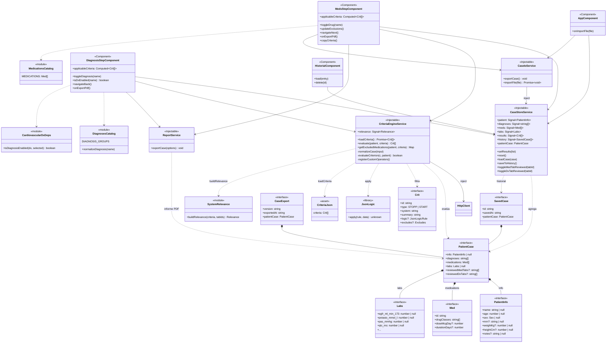
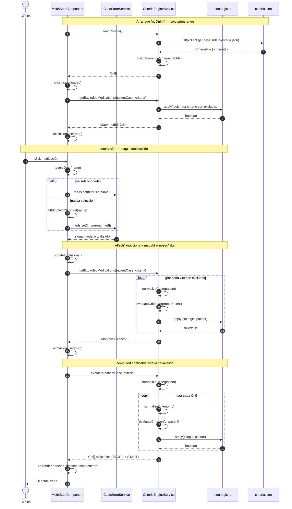
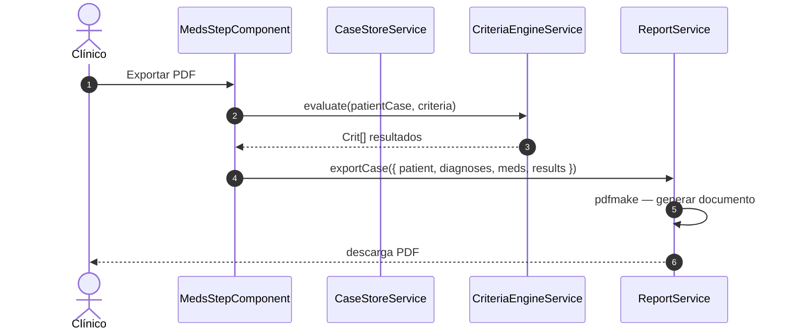

# Diagramas UML — STOPP/START v3 (`stopp-start-app`)

Aplicación Angular de apoyo a la decisión clínica que evalúa criterios **STOPP** (prescripciones potencialmente inapropiadas) y **START** (tratamientos indicados omitidos) según STOPP/START v3, mediante reglas JSON Logic en `criteria.json`.

Los diagramas reflejan la implementación actual (wizard de 2 pasos: medicaciones → diagnósticos).

---

## 1. Diagrama de clases

Dominio, servicios core, componentes del wizard y catálogos estáticos. Las flechas de dependencia (`-->`) indican inyección o uso en tiempo de ejecución.



---

## 2. Diagrama de casos de uso

**Actor principal:** clínico o farmacéutico que introduce el caso y consulta recomendaciones STOPP/START.

**Actores secundarios:** navegador (persistencia `localStorage`, descarga de archivos) y motor de criterios (evaluación automática vía JSON Logic).

```mermaid
useCaseDiagram
    left to right direction

    actor Clinico as "Clínico / farmacéutico"
    actor Navegador as "Navegador (localStorage)"
    actor Motor as "Motor de criterios"

    rectangle "STOPP/START v3 — Asistente clínico" {
        usecase UC01 as "Seleccionar medicaciones\npor sistema/tab"
        usecase UC02 as "Marcar pestaña revisada\n(sin selección)"
        usecase UC03 as "Navegar wizard\n(medicaciones ↔ diagnósticos)"
        usecase UC04 as "Seleccionar diagnósticos\n(con dependencias CV)"
        usecase UC05 as "Ver criterios STOPP/START\nen tiempo real"
        usecase UC06 as "Ver medicaciones excluidas\npor criterio cumplido"
        usecase UC07 as "Copiar texto de criterios\nal portapapeles"
        usecase UC08 as "Exportar informe PDF"
        usecase UC09 as "Exportar / importar\ncaso JSON"
        usecase UC10 as "Reiniciar caso"
        usecase UC11 as "Ajustar tamaño de fuente"
        usecase UC12 as "Consultar guía rápida"

        usecase UC_Eval as "Evaluar criterios\n(JSON Logic)"
        usecase UC_Persist as "Persistir estado\ndel caso"
        usecase UC_Load as "Cargar reglas\ncriteria.json"

        usecase UC13 as "Gestionar historial\nde casos"
        usecase UC14 as "Introducir paciente\ny analíticas"
    }

    Clinico --> UC01
    Clinico --> UC02
    Clinico --> UC03
    Clinico --> UC04
    Clinico --> UC05
    Clinico --> UC06
    Clinico --> UC07
    Clinico --> UC08
    Clinico --> UC09
    Clinico --> UC10
    Clinico --> UC11
    Clinico --> UC12

    UC05 ..> UC_Eval : «include»
    UC06 ..> UC_Eval : «include»
    UC08 ..> UC_Eval : «include»

    UC_Eval --> Motor
    UC_Load --> Motor

    UC01 --> UC_Persist
    UC04 --> UC_Persist
    UC09 --> UC_Persist
    UC_Persist --> Navegador

    UC09 ..> UC_Persist : «include»

    note right of UC13
        HistorialComponent implementado;
        sin ruta activa en app.routes
    end note

    note right of UC14
        PatientInfo y Labs en el modelo;
        sin paso dedicado en UI
    end note
```

### Resumen de casos de uso

| ID | Caso de uso | Componente principal |
|----|-------------|----------------------|
| UC01 | Seleccionar medicaciones | `MedsStepComponent` |
| UC02 | Marcar tab revisado | `CaseStoreService.toggle*TabReviewed` |
| UC03 | Navegar wizard | `Router` + pasos |
| UC04 | Seleccionar diagnósticos | `DiagnosisStepComponent` |
| UC05 | Ver criterios en vivo | `applicableCriteria` (computed) |
| UC06 | Ver exclusiones | `getExcludedMedications` |
| UC07 | Copiar criterios | `buildCriteriaText` |
| UC08 | Exportar PDF | `ReportService` |
| UC09 | Exportar/importar JSON | `CaseIoService` |
| UC10 | Reiniciar caso | `ConfirmResetDialog` → `reset()` |
| UC11–UC12 | Accesibilidad / ayuda | toolbar del paso |
| UC13–UC14 | Planificados / parciales | historial, datos paciente |

---

## 3. Diagrama de secuencia

Flujo crítico: el clínico activa o desactiva una medicación y la interfaz recalcula criterios aplicables y exclusiones de forma reactiva.



### Variante: exportar PDF



---

## Cómo visualizar

- **GitHub / GitLab:** los bloques `mermaid` se renderizan en el visor Markdown.
- **VS Code / Cursor:** extensión *Markdown Preview Mermaid Support*.
- **Exportar a imagen:** [Mermaid Live Editor](https://mermaid.live) — pegar cada bloque y exportar PNG/SVG para la memoria del TFG.

## Rutas y flujo de navegación (contexto)

```
/  →  /medicaciones  (MedsStepComponent)
/medicaciones  →  /diagnosticos  (DiagnosisStepComponent)
```
